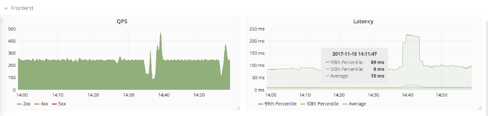

# RED

<p align="center"></p>
<p align="center">
  <a href="https://travis-ci.org/achilles42/red"></img></a>
  <a href="https://goreportcard.com/report/github.com/achilles42/red"></img></a>
  <a href="https://golangci.com"></img></a>
  <a href="https://coveralls.io/github/gojektech/achilles42?branch=master"></img></a>
</p>

RED (Request, Error and Duration) is a golang library, exposes total number of requests, error rate and duration of HTTP requests for a HTTP service out of the box. This library is inspired by Tom Wilkie's [RED methods](https://thenewstack.io/monitoring-microservices-red-method/)

From the Four Golden signals to the RED way of creating Metrics. The RED method is a subset of “The Four Golden Signals” that’s focused on micro-service architectures and which includes these metrics:

**Rate**: the number of requests our service is serving per second;

**Error**: the number of failed requests per second;

**Duration**: the amount of time it takes to process a request;

Measuring these metrics is pretty straightforward, especially with tools like Prometheus, and using the same metrics for every service helps us create a standard and easy-to-read format for dashboards that have to show the results.

## Usage

### Installation

```
go get github.com/achilles42/red
go get github.com/prometheus/client_golang/prometheus/promhttp
```

### Example

```
package main

import (
	"log"
	"net/http"
	"os"

	red "github.com/achilles42/red"
	"github.com/prometheus/client_golang/prometheus/promhttp"
)

func HandleHelloRequest() http.Handler {
	return http.HandlerFunc(func(w http.ResponseWriter, r *http.Request) {
		w.Write([]byte("Hello, World!"))
	})
}

func main() {
	addr := os.Getenv("ADDR")

	mux := http.NewServeMux()
	mux.Handle("/v1/hello", red.InstrumentationMiddleware(HandleHelloRequest()))
	mux.Handle("/metrics", promhttp.Handler())

	log.Printf("server is listening at %s", addr)
	log.Fatal(http.ListenAndServe(addr, mux))
}
```

To start the application:

> export ADDR=localhost:8080 && go run main.go

To access the metrics:

> curl http://localhost:8080/metrics

```
# HELP http_requests_total How many HTTP requests processed, partitioned by status code and HTTP method.
# TYPE http_requests_total counter
http_requests_total{method="GET",route="/v1/hello",status_code="200"} 1

# HELP request_duration_seconds Time (in seconds) spent serving HTTP requests.
# TYPE request_duration_seconds histogram
request_duration_seconds_bucket{method="GET",route="/v1/hello",status_code="200",le="0.005"} 3
request_duration_seconds_bucket{method="GET",route="/v1/hello",status_code="200",le="0.01"} 3
request_duration_seconds_bucket{method="GET",route="/v1/hello",status_code="200",le="0.025"} 3
```

### Setup Prometheus and Grafana

> docker run -p 9090:9090 -v /tmp/prometheus.yml:/etc/prometheus/prometheus.yml prom/prometheus

> docker run -d --name=grafana -p 3000:3000 grafana/grafana

> Add data source on Grafana with http://localhost:9090

> Import RED.json dashboard file located in docs/dashboard/RED.json

### RED Dashboard
<p align="lefts"></p>


## Contribution
1. Fork it
2. Create your feature branch (git checkout -b my-new-feature)
3. Commit your changes (git commit -am 'Add some feature')
4. Push to the branch (git push origin my-new-feature)
5. Create a new Pull Request

Bug reports and pull requests are welcome on GitHub at https://github.com/[USERNAME]/red
